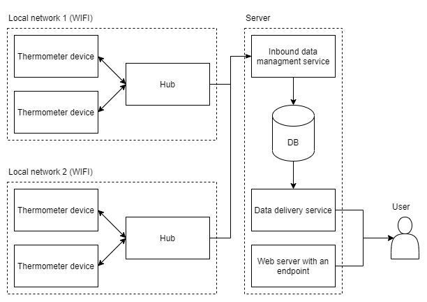
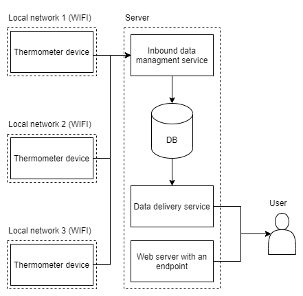

# TemperaControl - Concept

## Table of Contents

1. [**General Description**](#general-description)

# General Description

The main role of this system is to log temperatures in intervals from connected sensors. To make that happen devices and services must be made.

It is sure, that a temperature sensor must be build. For that a microcontroller from esp8266 familly is going to be used. WiFi is going to be a way for communication.

Logged data is going to be sent to a service on a server which is going to save in on a database.

Some way of data representation is needed. I want this part of a system to be as customizable, as it can be, thus providing just a rest api would be reasonable. With that this system could be implemented to already existing projects.

# Proposed approaches to an architecture of a system

I have came up with a few ideas for an architecture of a system and the main difference between them is in a way of communication between temperature sensors and a inbound data managment service on a remote server.

## Proposal 1

In this proposal, between sensors and a server there is a hub. It's role is to manage connected to it sensors and send temperature data to a server. This solution requires sensors and a hub to be in the same network. What makes this approach compelling is that it gives a lot of control over the sensors connected, though it makes setting up a fleet of sensors harder.

## Proposal 2

Simpler solution is to directly connect all sensors with a server. It makes setting up a fleet of sensors easier as there is no need to group them and it doesn't matter whether they are in the same network. This proposal makes managment of them harder.

## Proposal 3

It is possible to implement both of proposals. It allows customization for everyone needs. It makes inbound data managment service more complex.

